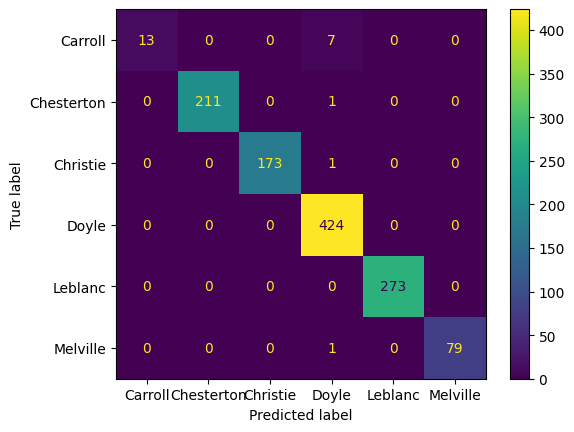
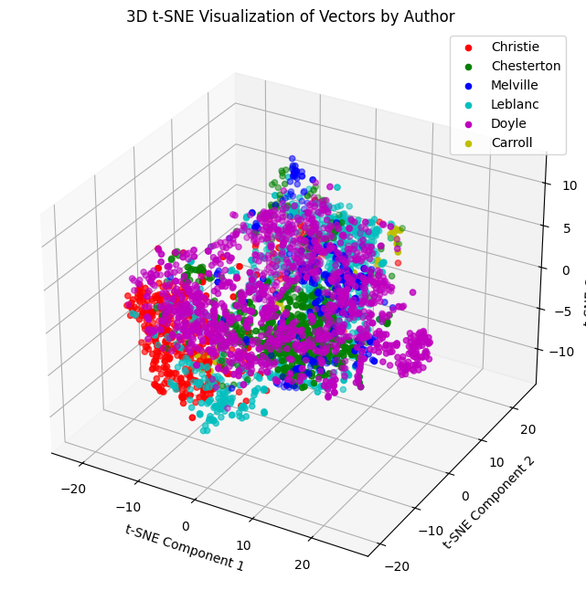
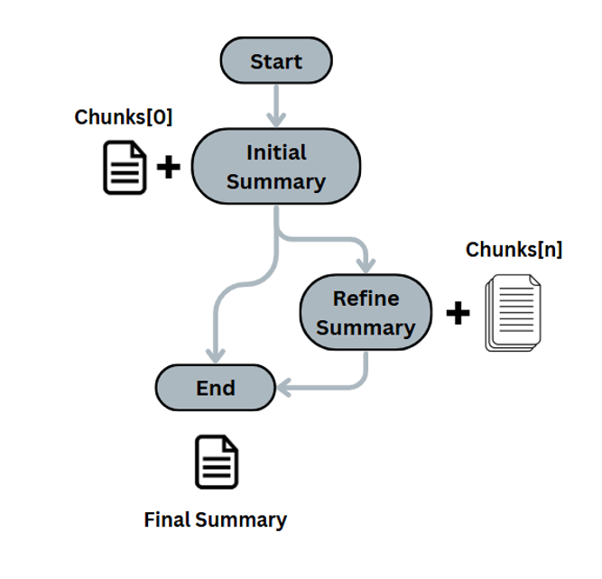
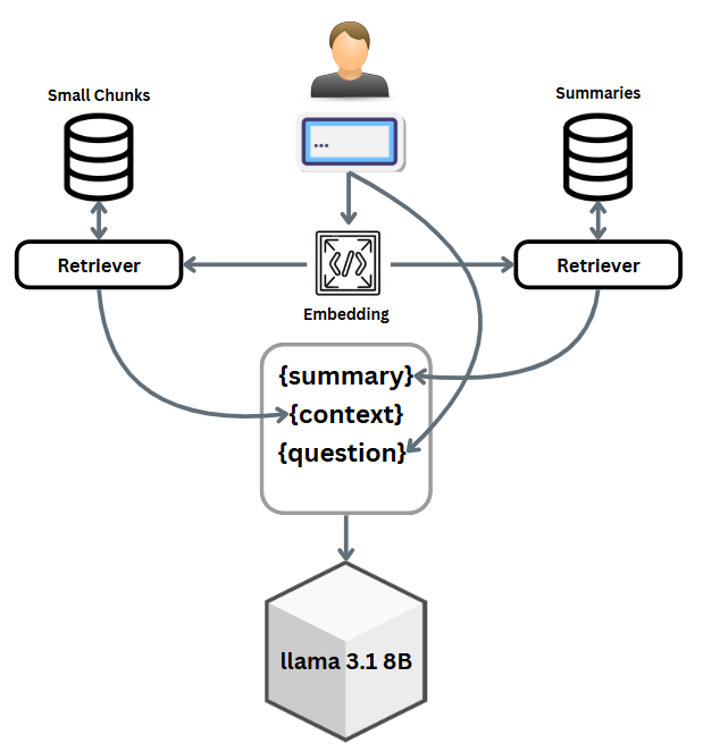

# NLP-524
Natural Language Processing 524 - Fall 2024

## Project 1 - Authorship Attribution

This project presents a comprehensive pipeline for text analysis and classification using literary works from Project Gutenberg, with a specific focus on authorship attribution. The workflow includes data cleaning to remove metadata, text chunking, and feature extraction techniques such as Bag of Words (BoW) and TF-IDF. The analysis leverages both supervised learning models, like Ridge Classifier and Support Vector Machine (SVM), and unsupervised approaches, such as word embeddings, t-SNE for dimensionality reduction, and KMeans clustering for visualization. The project emphasizes robust preprocessing, feature engineering, and the use of advanced machine learning techniques to explore patterns in text data.

## Project 2 - Buidling a Chatbot using RAG + LangChain

This project implements a chatbot focused on Agatha Christie's novels using Retrieval-Augmented Generation (RAG) and LangChain. The chatbot leverages two retrievers: one for summaries and another for text chunks. Summaries are generated through LangChain's iterative refinement method, ensuring cohesive and concise narratives. Chroma DB serves as the vector database, storing both the chunked text and summaries. The chatbot is designed to provide detailed and informative responses based on the novel summaries and context, enhancing user interaction with Agatha Christie's literary works.

 

### Authors

- Ahmad Amirivojdan (aamirivo@vols.utk.edu)
- Adam Ryan McDaniel (amcdan23@vols.utk.edu)
- Vincent Gregory Broda (vbroda@vols.utk.edu)
- Mohamed Shatarah (mshatara@vols.utk.edu)

